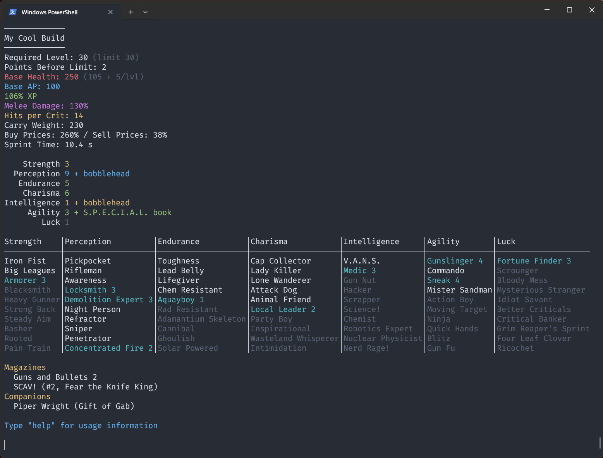

A command line build planner for Fallout 4

Supports:
- Saving/Loading builds
- Individual bobbleheads and special book bonuses
- Companion and magazine perks
- All perk descriptions
- Limiting level for constrained builds



Use the `sheet` command to show the table seen in the screenshot.

## Installation

Requires Git, Rust, and Cargo to be installed.

Run the following commands to install:

```
git clone https://github.com/kaikalii/fo4builder
cd fo4builder
cargo install --path .
```
Then run with `fo4builder`.